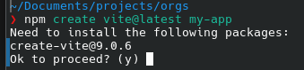
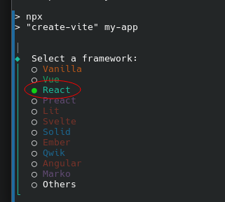
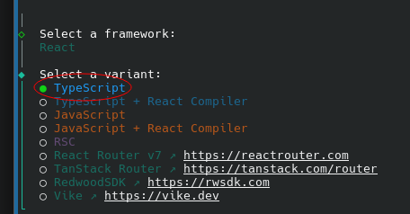
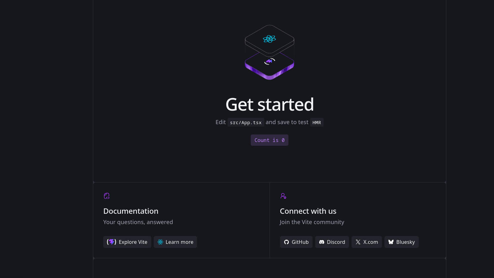

# Vite Frontend

	

---

## Overview

Install Vite with React, then run the usual dev/build workflow.

## Prerequisites

- Node.js 18+ and npm or pnpm

## Steps

1. Create a new Vite app:
	- npm: `npm create vite@latest my-app`
	- pnpm: `pnpm create vite@latest my-app`
   
2. When prompted, choose:
	- Framework: **React**

   
	- Variant: **React + TypeScript** (recommended) or **React**

   
3. Move into the project folder: `cd my-app`.
4. Install dependencies: `npm install` or `pnpm install`.
5. Start the dev server: `npm run dev`.
6. Open the local URL printed in the terminal to verify the app loads.
7. Build for production: `npm run build`.
8. Preview the production build locally: `npm run preview`.

 
## Troubleshooting

- Dev server fails to start: confirm Node.js version and reinstall dependencies.
- Prompts do not appear: run the create command without extra flags.
- Blank page: check the console output for missing env vars or build errors.

## Notes

- Environment variables should be set in your local shell or in a local env file that is not committed.